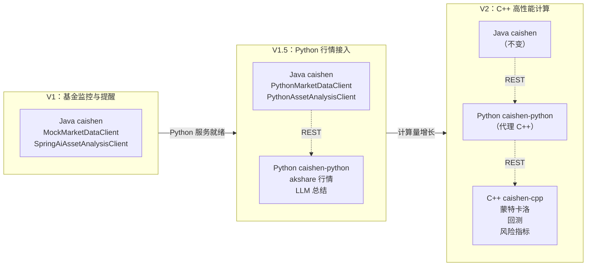

# Caishen C++ 服务开发计划

| 属性     | 值                 |
| -------- | ------------------ |
| 状态     | 草稿               |
| 负责人   | Caishen Owner      |
| 创建时间 | 2026-08-22         |
| 更新时间 | 2026-08-22         |
| 仓库     | 独立仓库，不在 OWL |

## 背景与目标

按照 [ADR-005](../adr/ADR-005-财神理财模块设计.md) 的技术分工，C++ 负责高性能计算，在 Python 或 Java 侧计算量无法满足延迟或吞吐要求时介入。

V1 阶段基金监控与提醒的计算量有限（日收益率、区间涨跌幅、阈值比较），Python 和 Java 侧足以胜任。因此 C++ 服务 **V1 不实现**，本计划定义 V2 的范围、接口契约和实施路线，确保后续接入时不修改 Java 控制器和持久化层。

### V2 目标（预期）

- 提供高性能指标计算服务：蒙特卡洛模拟、大规模历史回测、VaR/CVaR 风险指标、夏普比率等。
- 支持批量基金并行计算，单次请求处理 100+ 基金 × 10 年日线的计算量。
- 延迟目标：单基金回测 < 50ms，批量 100 基金 < 2s。

### 非目标

- 不做行情数据获取（Python 负责）。
- 不做 AI 总结生成（Python 负责）。
- 不做用户业务和持久化（Java 负责）。
- 不在 OWL Java 仓库中编写 C++ 源码。

## 技术选型

| 维度      | 选择                 | 原因                                        |
| --------- | -------------------- | ------------------------------------------- |
| 语言      | C++20                | 现代 C++，支持 concepts、ranges、coroutines |
| 构建系统  | CMake 3.20+          | 跨平台，依赖管理成熟                        |
| HTTP 框架 | drogon / userver     | 高性能异步 HTTP，适合微服务                 |
| 数学库    | Eigen3               | 线性代数、矩阵运算，Header-only             |
| 随机数    | PCG / xoshiro        | 高质量伪随机数生成器，蒙特卡洛场景          |
| JSON      | nlohmann/json        | Header-only，与 Python/Java 交互方便        |
| 容器化    | Docker (multi-stage) | 统一部署，与 OWL 编排                       |

## 项目结构

```text
caishen-cpp/
  CMakeLists.txt
  Dockerfile
  src/
    main.cpp                      # 服务入口
    config/
      Config.h/cpp                # 配置加载（环境变量 / JSON 文件）
    api/
      Router.h/cpp                # 路由注册
      MetricHandler.h/cpp         # /metric/* 端点处理
      HealthHandler.h/cpp         # /health 端点
    domain/
      Types.h                     # 核心类型定义（FundNav, MetricResult, ...）
      Request.h/cpp               # 请求模型
      Response.h/cpp              # 响应模型
    service/
      MetricService.h/cpp         # 指标计算调度
      MonteCarloService.h/cpp     # 蒙特卡洛模拟
      BacktestService.h/cpp       # 历史回测
      RiskService.h/cpp           # 风险指标（VaR, CVaR, 夏普）
    util/
      DateUtil.h/cpp              # 日期工具
      ParallelExecutor.h/cpp      # 并行计算执行器（线程池）
      MathUtil.h/cpp              # 数学工具函数
  tests/
    CMakeLists.txt
    test_monte_carlo.cpp
    test_backtest.cpp
    test_risk.cpp
    test_api.cpp
  benchmarks/
    bench_monte_carlo.cpp         # Google Benchmark 性能测试
    bench_backtest.cpp
```

## REST 契约

C++ 服务以独立 HTTP 服务运行，Python 服务作为代理调用（Java 侧不直接调用 C++，保持 ADR-005 的分层边界）。

### 通用约定

- 基础路径：`/api/caishen-cpp`
- 响应格式：统一 JSON `{ "code": 200, "message": "success", "data": ... }`
- 超时：Python 侧调用超时 5s（单基金）、30s（批量）

### 健康检查

```
GET /api/caishen-cpp/health
→ { "code": 200, "data": { "status": "UP", "version": "2.0.0" } }
```

### 蒙特卡洛模拟

```
POST /api/caishen-cpp/metric/monte-carlo
Content-Type: application/json

请求体：
{
  "navHistory": [1.01, 1.02, 1.015, 1.03, ...],   // 净值序列
  "simulations": 10000,                            // 模拟次数
  "timeHorizon": 30,                               // 预测天数
  "confidenceLevel": 0.95                          // 置信水平
}

响应体：
{
  "code": 200,
  "data": {
    "expectedReturn": 0.0345,
    "var95": -0.0234,
    "cvar95": -0.0312,
    "simulatedPaths": 10000,
    "computeTimeMs": 12
  }
}
```

### 历史回测

```
POST /api/caishen-cpp/metric/backtest
Content-Type: application/json

请求体：
{
  "funds": [
    {
      "fundCode": "000001",
      "navHistory": [
        { "date": "2020-01-01", "unitNav": 1.01 },
        ...
      ]
    }
  ],
  "strategy": "buy_and_hold",                     // buy_and_hold | dca | momentum
  "startDate": "2020-01-01",
  "endDate": "2026-08-22",
  "initialInvestment": 10000.0
}

响应体：
{
  "code": 200,
  "data": [
    {
      "fundCode": "000001",
      "totalReturn": 0.5234,
      "annualizedReturn": 0.0712,
      "maxDrawdown": -0.1823,
      "sharpeRatio": 1.23,
      "computeTimeMs": 8
    }
  ]
}
```

### 风险指标

```
POST /api/caishen-cpp/metric/risk
Content-Type: application/json

请求体：
{
  "navHistory": [1.01, 1.02, 1.015, 1.03, ...],
  "riskFreeRate": 0.02,
  "confidenceLevels": [0.90, 0.95, 0.99]
}

响应体：
{
  "code": 200,
  "data": {
    "volatility": 0.1567,
    "sharpeRatio": 1.23,
    "sortinoRatio": 1.56,
    "maxDrawdown": -0.1823,
    "var": { "0.90": -0.0156, "0.95": -0.0234, "0.99": -0.0389 },
    "cvar": { "0.90": -0.0198, "0.95": -0.0312, "0.99": -0.0456 },
    "computeTimeMs": 3
  }
}
```

## 服务详细设计

### MonteCarloService — 蒙特卡洛模拟

```cpp
class MonteCarloService {
public:
    struct Result {
        double expectedReturn;
        double var95;
        double cvar95;
        int simulatedPaths;
        double computeTimeMs;
    };

    Result simulate(
        const std::vector<double>& navHistory,
        int simulations,
        int timeHorizon,
        double confidenceLevel
    );
};
```

**算法**：

1. 从净值序列计算日对数收益率序列 `r_i = ln(nav_i / nav_{i-1})`。
2. 估计日收益率均值 `μ` 和标准差 `σ`。
3. 使用 PCG 随机数生成器，按几何布朗运动模型模拟 N 条路径：
   `S_t = S_0 * exp((μ - σ²/2) * t + σ * W_t)`
4. 计算终值分布，取分位数得到 VaR 和 CVaR。
5. 使用线程池并行模拟，每线程处理 N/threads 条路径。

### BacktestService — 历史回测

```cpp
class BacktestService {
public:
    struct Result {
        std::string fundCode;
        double totalReturn;
        double annualizedReturn;
        double maxDrawdown;
        double sharpeRatio;
        double computeTimeMs;
    };

    Result backtest(
        const std::vector<FundNav>& navHistory,
        const std::string& strategy,
        double initialInvestment
    );

    std::vector<Result> backtestBatch(
        const std::vector<std::vector<FundNav>>& fundsNavHistory,
        const std::string& strategy,
        double initialInvestment
    );
};
```

**策略**：

- `buy_and_hold`：期初全仓买入，持有到期末。
- `dca`：定期定额投入（月定投），计算总份额和期末市值。
- `momentum`：动量策略，按过去 N 个月涨跌幅决定当月是否持有。

**批量并行**：`backtestBatch` 使用 `ParallelExecutor` 线程池并行处理多只基金。

### RiskService — 风险指标

```cpp
class RiskService {
public:
    struct Result {
        double volatility;
        double sharpeRatio;
        double sortinoRatio;
        double maxDrawdown;
        std::map<double, double> var;
        std::map<double, double> cvar;
        double computeTimeMs;
    };

    Result calculate(
        const std::vector<double>& navHistory,
        double riskFreeRate,
        const std::vector<double>& confidenceLevels
    );
};
```

**指标定义**：

- 年化波动率：`σ_annual = σ_daily * sqrt(252)`
- 夏普比率：`SR = (R_p - R_f) / σ_annual`
- 索提诺比率：`Sortino = (R_p - R_f) / σ_downside`（只考虑下行波动）
- 最大回撤：`MDD = min((P_t - P_peak) / P_peak)`
- VaR：历史模拟法，取收益率分布的 α 分位数
- CVaR：VaR 以外的条件期望

## Python 侧代理调用

Python 服务在 V2 中增加对 C++ 服务的调用，Java 侧无需改动：

```python
class AnalysisService:
    def __init__(self, llm_client: LlmClient, cpp_client: CppMetricClient):
        self.llm_client = llm_client
        self.cpp_client = cpp_client

    async def generate_summary(self, metric_snapshot: str, period_type: str) -> SummaryResult:
        # V2: 先调用 C++ 计算风险指标，再让 AI 结合指标生成总结
        risk_metrics = await self.cpp_client.calculate_risk(nav_history, ...)
        enriched_snapshot = {**metric_snapshot, "riskMetrics": risk_metrics}
        summary = await self.llm_client.generate(enriched_snapshot, period_type)
        return summary
```

Python 侧新增 `CppMetricClient`：

```python
class CppMetricClient:
    def __init__(self, base_url: str):
        self.base_url = base_url

    async def calculate_risk(self, nav_history: list[float], risk_free_rate: float, ...) -> RiskResult:
        response = await httpx.post(f"{self.base_url}/api/caishen-cpp/metric/risk", json={...})
        return RiskResult(**response.json()["data"])

    async def monte_carlo(self, nav_history: list[float], ...) -> MonteCarloResult:
        ...

    async def backtest(self, funds: list[...], ...) -> list[BacktestResult]:
        ...
```

## 配置项

```cpp
struct Config {
    // 服务
    std::string host = "0.0.0.0";
    int port = 8101;
    int threads = 4;                    // HTTP 服务线程数

    // 计算
    int computeThreads = 8;             // 计算线程池大小
    int defaultSimulations = 10000;     // 蒙特卡洛默认模拟次数
    int batchSize = 100;                // 批量回测最大基金数

    // 超时
    int requestTimeoutMs = 30000;       // 请求超时
};
```

Python 侧配置新增：

```python
CAISHEN_CPP_ENABLED: bool = False      # 是否启用 C++ 服务
CAISHEN_CPP_URL: str = "http://caishen-cpp:8101"
```

## 实施步骤

### 阶段 1：项目骨架

- 初始化 `caishen-cpp` 项目，配置 CMake、drogon、Eigen3。
- 实现 `main.cpp`、`Config`、健康检查端点。
- 编写 `Dockerfile`（多阶段构建）。
- 验证服务可启动。

### 阶段 2：核心数学库

- 实现 `MathUtil`：对数收益率、年化、均值/标准差。
- 实现 `ParallelExecutor`：基于 `std::thread` 的线程池。
- 实现 PCG 随机数生成器封装。
- 编写单元测试和 Google Benchmark 性能测试。

### 阶段 3：蒙特卡洛模拟

- 实现 `MonteCarloService`：GBM 模型 + 并行模拟 + VaR/CVaR。
- 实现 `/metric/monte-carlo` 端点。
- 性能测试：10000 次模拟 < 50ms。

### 阶段 4：历史回测

- 实现 `BacktestService`：买入持有、定投、动量策略。
- 实现 `/metric/backtest` 端点。
- 批量并行测试：100 基金 < 2s。

### 阶段 5：风险指标

- 实现 `RiskService`：波动率、夏普、索提诺、最大回撤、VaR、CVaR。
- 实现 `/metric/risk` 端点。
- 与 Python numpy 计算结果对比验证精度。

### 阶段 6：Python 侧代理

- 在 Python 服务中实现 `CppMetricClient`。
- 修改 `AnalysisService`，当 C++ 启用时先调用 C++ 计算指标再调 AI。
- 集成测试：Python → C++ → 结果验证。

### 阶段 7：容器化与部署

- 完善 `Dockerfile`（多阶段构建，基于 gcc/alpine）。
- 更新 `docker-compose.yml`（加入 caishen-cpp 服务）。
- 配置健康检查和优雅关闭。

### 阶段 8：文档与验证

- 编写 C++ 服务 README（构建方式、配置项、REST 契约、性能基准）。
- 更新 ADR-005，标记 C++ 服务已就绪。
- 端到端测试：Java → Python → C++ → 结果验证。

## V1 → V2 演进路线



**关键原则**：每次演进 Java 侧控制器和持久化层不变，只切换 Client 实现或 Python 代理逻辑。

## 待定问题

- C++ HTTP 框架选型：drogon（成熟但较重）vs userver（Yandex 出品，异步原生）vs 自写轻量 HTTP。
- 是否提供 gRPC 接口（比 REST 更低延迟），Python 侧用 grpcio 调用。
- 蒙特卡洛是否需要 GPU 加速（CUDA），何时引入。
- C++ 服务的部署方式：独立容器还是与 Python 共存（sidecar 模式）。
- 数值精度：C++ double 与 Python float64 的对齐验证。

## 变更历史

- 2026-08-22：创建 C++ 服务开发计划草稿（V2 范围，V1 不实现）。

## 相关文档

- [ADR-005 Caishen 理财模块设计](../adr/ADR-005-财神理财模块设计.md)
- [Caishen V1 基金监控与提醒方案](caishen-v1-fund-monitor-plan.md)
- [Caishen Python 服务开发计划](caishen-python-service-plan.md)
- [文档中心](../README.md)
