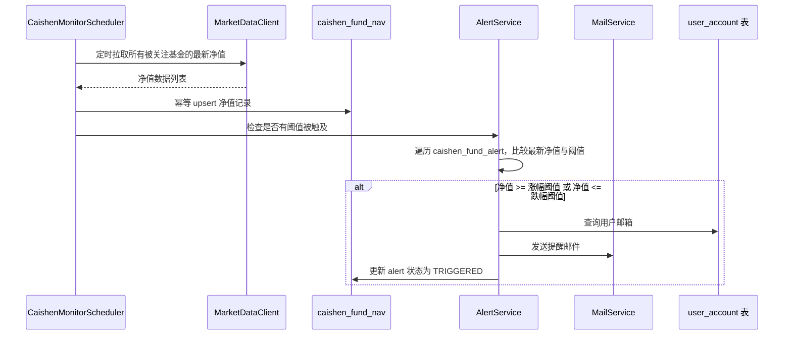
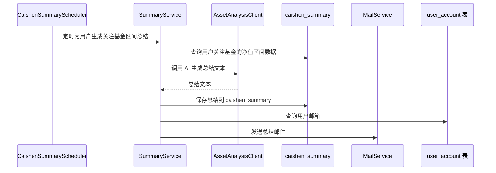
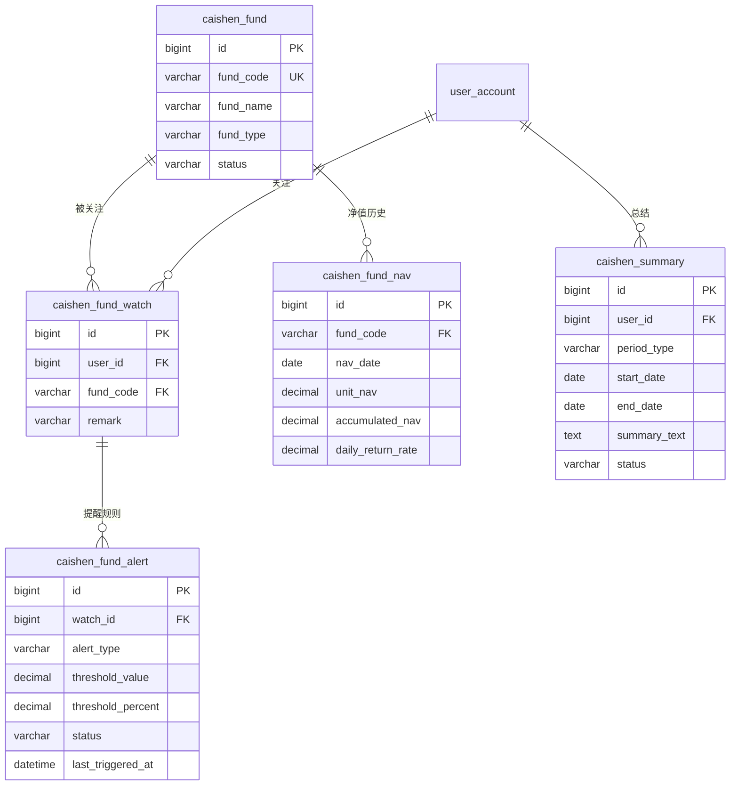

# Caishen V1 基金监控与提醒方案

| 属性     | 值            |
| -------- | ------------- |
| 状态     | 草稿          |
| 负责人   | Caishen Owner |
| 创建时间 | 2026-08-22    |
| 更新时间 | 2026-08-22    |

## 背景与目标

OWL 理财模块代号 caishen，此前 [ADR-005](../adr/ADR-005-财神理财模块设计.md) 和[旧开发计划](caishen-finance-module-plan.md)规划了基金/股票档案、净值/日线、持仓、总结等全量能力，范围较大。

本方案将 V1 收敛为**基金监控与提醒**单一核心场景，目标是：

- 用户可选择并关注一个或多个基金。
- 系统定时抓取关注基金的最新净值，计算涨跌幅。
- 用户可为每个关注的基金设置提醒阈值（涨到多少 / 跌到多少）。
- 净值触及阈值时，系统自动发送邮件提醒到用户注册邮箱。
- 系统定时为用户生成关注基金的区间变化总结。

非目标：

- 不做股票监控（V2 扩展）。
- 不做实盘交易、下单和风控。
- 不提供投资建议，总结与提醒仅作为辅助信息。
- 不在本仓库编写 Python/C++ 源码。

## 模块落点

| 项目             | 值                       |
| ---------------- | ------------------------ |
| 模块目录         | `watermelon/caishen`     |
| Maven artifactId | `caishen`                |
| 基础包           | `xyz.nanian.owl.caishen` |
| 接口前缀         | `/api/caishen`           |
| API 分组         | 理财中心-caishen         |

注册动作（详见[新模块添加手册](../guides/新模块开发指南.md)）：

1. 根 `pom.xml` 的 `<modules>` 与 `<dependencyManagement>` 增加 caishen。
2. `start/pom.xml` 增加 caishen 依赖。
3. `common/.../config/SpringdocConfig.java` 增加分组：

```java
@Bean
public GroupedOpenApi caishenApi() {
    return GroupedOpenApi.builder()
            .group("理财中心-caishen")
            .packagesToScan("xyz.nanian.owl.caishen.controller")
            .build();
}
```

4. 所有接口默认需要登录，无需额外配置白名单。

## 核心流程

### 监控与提醒流程



### 总结生成流程



## 数据模型

V1 只需 5 张表，相比旧方案去掉 `caishen_stock`、`caishen_stock_daily`、`caishen_holding` 三张股票和持仓表。

### ER 概览



### 表结构

#### `caishen_fund` — 基金档案

| 字段        | 类型            | 约束               | 说明                                         |
| ----------- | --------------- | ------------------ | -------------------------------------------- |
| id          | BIGINT UNSIGNED | PK, AUTO_INCREMENT | 主键                                         |
| fund_code   | VARCHAR(20)     | NOT NULL, UNIQUE   | 基金代码，如 `000001`                        |
| fund_name   | VARCHAR(100)    | NOT NULL           | 基金名称                                     |
| fund_type   | VARCHAR(20)     | NULL               | 基金类型：股票型/混合型/债券型/货币型/指数型 |
| status      | TINYINT(1)      | NOT NULL DEFAULT 1 | 1=正常, 0=停用                               |
| create_time | DATETIME        | NOT NULL           | 创建时间                                     |
| update_time | DATETIME        | NOT NULL           | 更新时间                                     |

索引：`uk_fund_code(fund_code)`

#### `caishen_fund_nav` — 基金净值历史

| 字段              | 类型            | 约束               | 说明                                    |
| ----------------- | --------------- | ------------------ | --------------------------------------- |
| id                | BIGINT UNSIGNED | PK, AUTO_INCREMENT | 主键                                    |
| fund_code         | VARCHAR(20)     | NOT NULL           | 基金代码                                |
| nav_date          | DATE            | NOT NULL           | 净值日期                                |
| unit_nav          | DECIMAL(10,4)   | NOT NULL           | 单位净值                                |
| accumulated_nav   | DECIMAL(10,4)   | NULL               | 累计净值                                |
| daily_return_rate | DECIMAL(8,4)    | NULL               | 日收益率（%），如 `1.2345` 表示 1.2345% |
| source            | VARCHAR(20)     | NULL               | 数据来源：mock / python / manual        |
| create_time       | DATETIME        | NOT NULL           | 创建时间                                |

索引：`uk_fund_nav_date(fund_code, nav_date)`，`idx_nav_date(nav_date)`

#### `caishen_fund_watch` — 用户关注基金

| 字段        | 类型            | 约束               | 说明                    |
| ----------- | --------------- | ------------------ | ----------------------- |
| id          | BIGINT UNSIGNED | PK, AUTO_INCREMENT | 主键                    |
| user_id     | BIGINT          | NOT NULL           | 用户 ID，关联 `user_account.id` |
| fund_code   | VARCHAR(20)     | NOT NULL           | 基金代码                |
| remark      | VARCHAR(200)    | NULL               | 用户备注，如"定投基金"  |
| create_time | DATETIME        | NOT NULL           | 创建时间                |
| update_time | DATETIME        | NOT NULL           | 更新时间                |

索引：`uk_user_fund(user_id, fund_code)`，`idx_user_id(user_id)`

#### `caishen_fund_alert` — 提醒规则

| 字段              | 类型            | 约束                      | 说明                                                 |
| ----------------- | --------------- | ------------------------- | ---------------------------------------------------- |
| id                | BIGINT UNSIGNED | PK, AUTO_INCREMENT        | 主键                                                 |
| watch_id          | BIGINT          | NOT NULL                  | 关联 `caishen_fund_watch.id`，级联删除               |
| alert_type        | VARCHAR(20)     | NOT NULL                  | 提醒类型：`RISE_ABOVE`（涨到）/ `FALL_BELOW`（跌到） |
| threshold_value   | DECIMAL(10,4)   | NULL                      | 绝对净值阈值，如净值涨到 1.5000 提醒                 |
| threshold_percent | DECIMAL(8,4)    | NULL                      | 涨跌幅阈值（%），如日涨幅超过 2% 提醒                |
| status            | VARCHAR(20)     | NOT NULL DEFAULT 'ACTIVE' | ACTIVE=生效中, TRIGGERED=已触发, PAUSED=暂停         |
| last_triggered_at | DATETIME        | NULL                      | 最近一次触发时间                                     |
| create_time       | DATETIME        | NOT NULL                  | 创建时间                                             |
| update_time       | DATETIME        | NOT NULL                  | 更新时间                                             |

索引：`idx_watch_id(watch_id)`，`idx_status(status)`

**阈值触发逻辑**：

- `RISE_ABOVE` + `threshold_value`：最新净值 >= 设定值时触发。
- `RISE_ABOVE` + `threshold_percent`：日收益率 >= 设定百分比时触发。
- `FALL_BELOW` + `threshold_value`：最新净值 <= 设定值时触发。
- `FALL_BELOW` + `threshold_percent`：日收益率 <= 负的设定百分比时触发。
- 触发后状态改为 `TRIGGERED`，用户可手动重置为 `ACTIVE` 继续监控。
- 同一规则同一天不重复触发（`last_triggered_at` 当天已触发则跳过）。

#### `caishen_summary` — 总结记录

| 字段            | 类型            | 约束               | 说明                                     |
| --------------- | --------------- | ------------------ | ---------------------------------------- |
| id              | BIGINT UNSIGNED | PK, AUTO_INCREMENT | 主键                                     |
| user_id         | BIGINT          | NOT NULL           | 用户 ID                                  |
| period_type     | VARCHAR(10)     | NOT NULL           | 周期类型：`DAILY` / `WEEKLY` / `MONTHLY` |
| start_date      | DATE            | NOT NULL           | 统计开始日期                             |
| end_date        | DATE            | NOT NULL           | 统计结束日期                             |
| metric_snapshot | TEXT            | NULL               | 指标快照 JSON，如各基金涨跌幅            |
| summary_text    | TEXT            | NULL               | AI 生成的总结文本                        |
| status          | VARCHAR(20)     | NOT NULL           | PENDING / PROCESSING / SUCCESS / FAILED  |
| error_message   | VARCHAR(500)    | NULL               | 失败时的错误信息                         |
| create_time     | DATETIME        | NOT NULL           | 创建时间                                 |
| update_time     | DATETIME        | NOT NULL           | 更新时间                                 |

索引：`idx_user_id(user_id)`，`idx_status(status)`

### DDL 位置

DDL 放在 `.docs/database/OWL/caishen/caishen_db.sql`。

## 模块代码结构

```text
watermelon/caishen/
  src/main/java/xyz/nanian/owl/caishen/
    config/
      CaishenConfig.java              # 模块配置属性（调度频率、AI provider 等）
      CaishenSchedulingConfig.java    # @EnableScheduling + 线程池
    constant/
      AlertType.java                  # RISE_ABOVE, FALL_BELOW
      AlertStatus.java                # ACTIVE, TRIGGERED, PAUSED
      SummaryStatus.java              # PENDING, PROCESSING, SUCCESS, FAILED
      PeriodType.java                 # DAILY, WEEKLY, MONTHLY
    controller/
      FundController.java             # 基金档案与净值查询
      WatchController.java            # 关注管理
      AlertController.java            # 提醒规则 CRUD
      SummaryController.java          # 总结查询
    domain/
      entity/
        CaishenFundDO.java
        CaishenFundNavDO.java
        CaishenFundWatchDO.java
        CaishenFundAlertDO.java
        CaishenSummaryDO.java
      dto/
        FundWatchCreateDTO.java       # 关注基金入参
        FundAlertCreateDTO.java       # 创建提醒规则入参
        FundAlertUpdateDTO.java       # 更新提醒规则入参
        SummaryQueryDTO.java          # 总结查询入参
      vo/
        FundVO.java                   # 基金档案出参
        FundNavVO.java                # 净值出参
        FundWatchVO.java              # 关注出参（含基金名称、最新净值）
        FundAlertVO.java              # 提醒规则出参（含触发状态）
        SummaryVO.java                # 总结出参
    mapper/
      CaishenFundMapper.java
      CaishenFundNavMapper.java
      CaishenFundWatchMapper.java
      CaishenFundAlertMapper.java
      CaishenSummaryMapper.java
    mapstruct/
      CaishenFundConvert.java
      CaishenFundWatchConvert.java
      CaishenFundAlertConvert.java
      CaishenSummaryConvert.java
    service/
      FundService.java                # 基金档案与净值查询
      WatchService.java               # 关注增删改查
      AlertService.java               # 提醒规则 CRUD + 阈值检查 + 邮件发送
      SummaryService.java              # 总结生成与查询
      impl/
    scheduler/
      CaishenMonitorScheduler.java    # 定时拉净值 + 检查阈值 + 发邮件
      CaishenSummaryScheduler.java    # 定时生成总结 + 发邮件
    client/
      MarketDataClient.java           # 行情数据获取接口
      AssetAnalysisClient.java        # AI 总结接口
      mock/
        MockMarketDataClient.java     # 开发期 Mock 行情
        MockAssetAnalysisClient.java  # 开发期 Mock 总结
      springai/
        SpringAiAssetAnalysisClient.java  # Spring AI 总结实现
```

## 服务边界

### Java 侧职责

- 基金档案与净值历史的查询和持久化。
- 用户关注基金的增删改查，按 `user_id` 隔离。
- 提醒规则的 CRUD、阈值检查与邮件触发。
- 定时调度：净值同步、阈值检查、总结生成。
- 作为 `MarketDataClient` 和 `AssetAnalysisClient` 的调用方，不直接实现行情源和 AI 大模型。

### 外部服务契约

`MarketDataClient` — 行情数据获取：

```java
public interface MarketDataClient {
    /**
     * 获取指定基金代码列表的最新净值。
     *
     * @param fundCodes 基金代码列表
     * @return 净值数据列表（fundCode, navDate, unitNav, accumulatedNav, dailyReturnRate）
     */
    List<FundNavData> fetchLatestNav(List<String> fundCodes);
}
```

- V1 实现：`MockMarketDataClient`，返回可配置的演示数据。
- 后续：`PythonMarketDataClient` 调用 Python 服务获取真实行情。

`AssetAnalysisClient` — AI 总结生成：

```java
public interface AssetAnalysisClient {
    /**
     * 根据指标快照生成总结文本。
     *
     * @param metricSnapshot 指标快照 JSON
     * @param periodType     周期类型
     * @return 总结文本
     */
    String generateSummary(String metricSnapshot, String periodType);
}
```

- V1 实现：`SpringAiAssetAnalysisClient`（复用 crow 模块已有的 Spring AI 基础设施）或 `MockAssetAnalysisClient`。
- 配置项：`caishen.analysis.provider=spring-ai|mock`。

### 邮件发送

复用 `common` 模块的 `MailService`，收件人邮箱从 `user_account` 表的 `email` 字段获取（用户注册时初始化）。

提醒邮件示例：

```
收件人：user_account.email
主题：【OWL 理财提醒】基金 000001（华夏成长）净值触及阈值
正文（HTML）：
  您关注的基金「华夏成长（000001）」已触及您设置的提醒阈值：
  - 提醒类型：涨到
  - 阈值：1.5000
  - 当前净值：1.5234（2026-08-22）
  - 日收益率：+1.56%
  请登录查看详情。
```

总结邮件示例：

```
收件人：user_account.email
主题：【OWL 理财周报】您关注的基金本周变化总结
正文（HTML）：
  您关注的 3 只基金本周（2026-08-16 ~ 2026-08-22）变化如下：
  - 华夏成长（000001）：周涨幅 +2.34%
  - 易方达蓝筹（005827）：周涨幅 -0.87%
  - ...
  AI 总结：本周市场整体震荡上行，您关注的股票型基金表现优于混合型...
```

## 定时调度

V1 使用 Spring `@Scheduled`，在 `CaishenSchedulingConfig` 中开启 `@EnableScheduling` 并配置专用线程池。

| 调度任务            | Cron 表达式                      | 说明                                             |
| ------------------- | -------------------------------- | ------------------------------------------------ |
| 净值同步 + 阈值检查 | `0 0 15 * * ?`（每天 15:00）     | 拉取所有被关注基金的最新净值，检查阈值，触发邮件 |
| 日总结生成          | `0 30 15 * * ?`（每天 15:30）    | 为所有有关注基金的用户生成日总结                 |
| 周总结生成          | `0 0 16 ? * MON`（每周一 16:00） | 为所有有关注基金的用户生成周总结                 |

调度频率可通过 `CaishenConfig` 的配置属性调整：

```yaml
caishen:
  schedule:
    nav-sync-cron: '0 0 15 * * ?'
    daily-summary-cron: '0 30 15 * * ?'
    weekly-summary-cron: '0 0 16 ? * MON'
  analysis:
    provider: spring-ai
```

## API 设计

所有接口返回 `Result<T>`，分页返回 `ResultPage<T>`。全部接口需要登录。

### 基金档案与净值

| 方法 | 路径                                | 鉴权 | 请求                                             | 响应 data               | 说明                         |
| ---- | ----------------------------------- | ---- | ------------------------------------------------ | ----------------------- | ---------------------------- |
| GET  | `/api/caishen/funds`                | 登录 | `keyword` 查询参数                               | `FundVO[]`              | 搜索基金（按代码或名称模糊） |
| GET  | `/api/caishen/funds/{fundCode}`     | 登录 | 路径 fundCode                                    | `FundVO`                | 基金详情                     |
| GET  | `/api/caishen/funds/{fundCode}/nav` | 登录 | `pageNum` / `pageSize` / `startDate` / `endDate` | `ResultPage<FundNavVO>` | 净值历史分页                 |

### 关注管理

| 方法   | 路径                        | 鉴权 | 请求                 | 响应 data       | 说明                         |
| ------ | --------------------------- | ---- | -------------------- | --------------- | ---------------------------- |
| GET    | `/api/caishen/watches`      | 登录 | -                    | `FundWatchVO[]` | 我的关注列表（含最新净值）   |
| POST   | `/api/caishen/watches`      | 登录 | `FundWatchCreateDTO` | Long watchId    | 添加关注                     |
| DELETE | `/api/caishen/watches/{id}` | 登录 | 路径 id              | null            | 取消关注（级联删除提醒规则） |
| PUT    | `/api/caishen/watches/{id}` | 登录 | 路径 id + `remark`   | null            | 更新备注                     |

### 提醒规则

| 方法   | 路径                                    | 鉴权 | 请求                 | 响应 data       | 说明                       |
| ------ | --------------------------------------- | ---- | -------------------- | --------------- | -------------------------- |
| GET    | `/api/caishen/watches/{watchId}/alerts` | 登录 | 路径 watchId         | `FundAlertVO[]` | 某关注的全部提醒规则       |
| POST   | `/api/caishen/watches/{watchId}/alerts` | 登录 | `FundAlertCreateDTO` | Long alertId    | 新增提醒规则               |
| PUT    | `/api/caishen/alerts/{id}`              | 登录 | `FundAlertUpdateDTO` | null            | 更新提醒规则（阈值、状态） |
| DELETE | `/api/caishen/alerts/{id}`              | 登录 | 路径 id              | null            | 删除提醒规则               |
| PUT    | `/api/caishen/alerts/{id}/reset`        | 登录 | 路径 id              | null            | 重置为 ACTIVE（继续监控）  |

### 总结

| 方法 | 路径                          | 鉴权 | 请求                                  | 响应 data               | 说明             |
| ---- | ----------------------------- | ---- | ------------------------------------- | ----------------------- | ---------------- |
| GET  | `/api/caishen/summaries`      | 登录 | `periodType` / `pageNum` / `pageSize` | `ResultPage<SummaryVO>` | 我的总结列表     |
| GET  | `/api/caishen/summaries/{id}` | 登录 | 路径 id                               | `SummaryVO`             | 总结详情         |
| POST | `/api/caishen/summaries`      | 登录 | `periodType`                          | Long summaryId          | 手动触发生成总结 |

### 请求模型

#### `FundWatchCreateDTO`

| 字段     | 类型   | 必填 | 说明           |
| -------- | ------ | ---- | -------------- |
| fundCode | string | 是   | 基金代码       |
| remark   | string | 否   | 备注，最大 200 |

#### `FundAlertCreateDTO`

| 字段             | 类型   | 必填 | 说明                                      |
| ---------------- | ------ | ---- | ----------------------------------------- |
| alertType        | string | 是   | `RISE_ABOVE` 或 `FALL_BELOW`              |
| thresholdValue   | number | 否   | 绝对净值阈值，与 thresholdPercent 二选一  |
| thresholdPercent | number | 否   | 涨跌幅阈值（%），与 thresholdValue 二选一 |

#### `FundAlertUpdateDTO`

| 字段             | 类型   | 必填 | 说明                |
| ---------------- | ------ | ---- | ------------------- |
| alertType        | string | 否   | 提醒类型            |
| thresholdValue   | number | 否   | 阈值                |
| thresholdPercent | number | 否   | 百分比阈值          |
| status           | string | 否   | `ACTIVE` / `PAUSED` |

### 响应模型

#### `FundWatchVO`

| 字段            | 类型   | 说明             |
| --------------- | ------ | ---------------- |
| id              | Long   | 关注 ID          |
| fundCode        | string | 基金代码         |
| fundName        | string | 基金名称         |
| latestNav       | number | 最新单位净值     |
| latestNavDate   | string | 最新净值日期     |
| dailyReturnRate | number | 日收益率（%）    |
| remark          | string | 备注             |
| alertCount      | int    | 关联提醒规则数量 |
| createTime      | string | 创建时间         |

#### `FundAlertVO`

| 字段             | 类型   | 说明         |
| ---------------- | ------ | ------------ |
| id               | Long   | 提醒规则 ID  |
| watchId          | Long   | 关注 ID      |
| fundCode         | string | 基金代码     |
| fundName         | string | 基金名称     |
| alertType        | string | 提醒类型     |
| thresholdValue   | number | 绝对净值阈值 |
| thresholdPercent | number | 百分比阈值   |
| status           | string | 状态         |
| lastTriggeredAt  | string | 最近触发时间 |
| createTime       | string | 创建时间     |

#### `SummaryVO`

| 字段        | 类型   | 说明     |
| ----------- | ------ | -------- |
| id          | Long   | 总结 ID  |
| periodType  | string | 周期类型 |
| startDate   | string | 开始日期 |
| endDate     | string | 结束日期 |
| summaryText | string | 总结文本 |
| status      | string | 状态     |
| createTime  | string | 创建时间 |

## 实施步骤

### 阶段 1：模块骨架

- 创建 `watermelon/caishen` 目录、`pom.xml` 和基础包。
- 注册根 pom、start pom、Springdoc 分组。
- 验证 `mvn compile -pl watermelon/caishen -am`。

### 阶段 2：数据库与实体

- 编写 `caishen_db.sql`（5 张表）。
- 创建 DO、Mapper、MapStruct Convert。
- 验证唯一键和索引。

### 阶段 3：基金档案与净值

- `FundController`：基金搜索、详情、净值分页。
- `FundService`：查询逻辑。
- `MockMarketDataClient`：返回演示数据。

### 阶段 4：关注管理

- `WatchController`：关注增删改查。
- `WatchService`：按 `CurrentUserContext.getUserId()` 隔离。
- 取消关注时级联删除关联的提醒规则。

### 阶段 5：提醒规则

- `AlertController`：提醒规则 CRUD + 重置。
- `AlertService`：阈值检查逻辑、邮件发送。
- 阈值检查：遍历 ACTIVE 规则，比较最新净值，触发后更新状态和 `last_triggered_at`。
- 邮件发送：通过 `MailService.send(MailMessage)` 发送 HTML 邮件到 `user_account.email`。

### 阶段 6：定时调度

- `CaishenSchedulingConfig`：`@EnableScheduling` + 定时任务线程池。
- `CaishenMonitorScheduler`：每天 15:00 拉净值 → 检查阈值 → 发邮件。
- `CaishenSummaryScheduler`：日/周总结生成 + 发邮件。
- `CaishenConfig`：Cron 表达式和 AI provider 配置属性。

### 阶段 7：总结生成

- `SummaryService`：查询区间净值数据，组装指标快照，调用 `AssetAnalysisClient` 生成总结。
- `SpringAiAssetAnalysisClient`：复用 Spring AI 生成总结。
- 总结异步执行，状态机 PENDING → PROCESSING → SUCCESS / FAILED。

### 阶段 8：验证

- 启动 start 模块，验证 `/doc.html` 和 caishen 分组。
- 手动触发净值同步，验证阈值检查和邮件发送。
- 手动触发总结生成，验证 AI 调用和邮件发送。
- 执行 `mvn test -pl watermelon/caishen -am`。

## 与旧方案的关系

本方案是 [旧开发计划](caishen-finance-module-plan.md) 的 V1 收敛版：

| 维度     | 旧方案                 | V1 方案                                   |
| -------- | ---------------------- | ----------------------------------------- |
| 资产类型 | 基金 + 股票            | 仅基金                                    |
| 核心场景 | 档案查询 + 持仓 + 总结 | 监控 + 提醒 + 总结                        |
| 表数量   | 7 张                   | 5 张（去掉股票、日线、持仓）              |
| 新增能力 | 无                     | 提醒规则 + 阈值触发 + 邮件通知            |
| 定时调度 | 仅数据同步             | 净值同步 + 阈值检查 + 总结生成 + 邮件发送 |
| 外部依赖 | Python/C++ 预留        | 同，V1 用 Mock/Spring AI                  |

V2 可在 V1 基础上扩展：股票监控、持仓管理、Python 行情源接入、C++ 指标计算。

## 待定问题

- 净值数据源：V1 用 Mock，后续接入 Python 服务或公开 API（如天天基金、东方财富）。
- 提醒频率：同一规则同一天只触发一次是否足够，是否需要冷却时间配置。
- 总结 AI provider：V1 用 Spring AI 还是 Mock，建议先用 Spring AI 保住闭环。
- 邮件发送失败处理：是否需要重试机制，是否记录发送日志。
- 多用户并发调度：定时任务遍历所有用户，用户量增长后是否需要分批处理。

## 变更历史

- 2026-08-22：创建 V1 基金监控与提醒方案草稿，收敛自旧开发计划。

## 相关文档

- [ADR-005 Caishen 理财模块设计](../adr/ADR-005-财神理财模块设计.md)
- [Caishen Python 服务开发计划](caishen-python-service-plan.md)（行情获取 + AI 总结）
- [Caishen C++ 服务开发计划](caishen-cpp-service-plan.md)（高性能计算，V2 实现）
- [旧开发计划（全量方案）](caishen-finance-module-plan.md)
- [新模块添加手册](../guides/新模块开发指南.md)
- [文档中心](../README.md)
