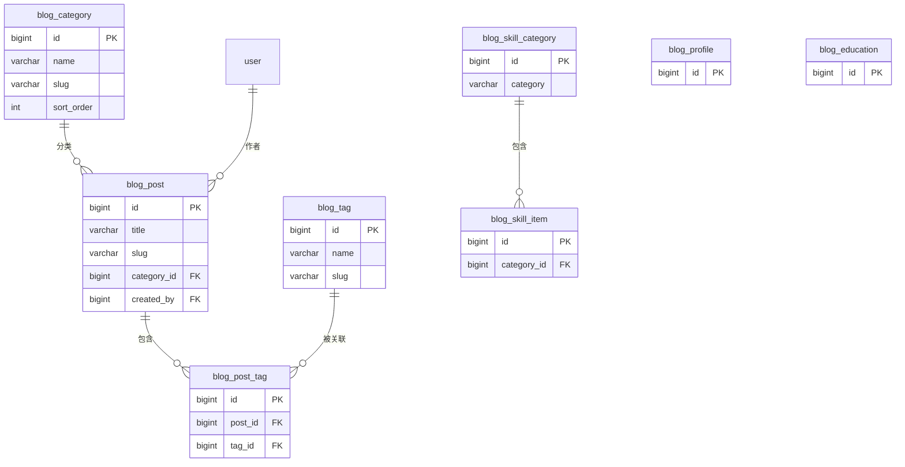

# mango 博客模块开发计划

| 属性     | 值          |
| -------- | ----------- |
| 状态     | 草稿        |
| 负责人   | mango Owner |
| 创建时间 | 2026-08-22  |
| 更新时间 | 2026-08-22  |

## 背景与目标

OWL 需要新增个人博客模块，代号 mango（替代此前 [ADR-004](ADR-004-个人博客模块设计.md) 使用的 kiwi）。前端模块 `src/modules/blog` 当前全部数据为硬编码常量（`constants/posts.ts`、`constants/education.ts`、`constants/skills.ts`），未接入任何后端接口。

本文档结合既有架构决策汇总为综合方案：

- 既有架构决策：[ADR-004 个人博客模块设计](ADR-004-个人博客模块设计.md)

目标：

- 明确模块落点（代号 mango、模块目录、包名、接口前缀）。
- 给出数据库设计（ER、表结构、canonical DDL）与接口设计（端点、DTO/VO、鉴权、分页）。
- 对齐 OWL 后端规范：`Result<T>` / `ResultPage<T>`、Spring Security、MyBatis-Plus、Knife4j。
- 给出分阶段实施步骤，供后端按步骤落地。

非目标：

- 不做评论、RSS、全文检索（Elasticsearch）等 v1 范围外能力，见[待定问题](#待定问题)。
- 不涉及前端实现细节，仅约定接口契约。

## 模块落点

| 项目             | 值                                            |
| ---------------- | --------------------------------------------- |
| 模块目录         | `watermelon/mango`                            |
| Maven artifactId | `mango`                                       |
| 基础包           | `xyz.nanian.owl.mango`                        |
| 中文代号         | mango                                         |
| 接口前缀         | `/api/blog`（与前端 `src/modules/blog` 对齐） |
| 数据表前缀       | `blog_`                                       |
| API 分组         | 博客中心-mango                                |

注册动作（详见[新模块添加手册](../guides/新模块开发指南.md)）：

1. 根 `pom.xml` 的 `<modules>` 与 `<dependencyManagement>` 增加 mango。
2. `start/pom.xml` 增加 mango 依赖。
3. `common/.../security/config/SecurityConfig.java` 将公开读接口加入白名单：
   ```java
   .requestMatchers(HttpMethod.GET, "/api/blog/**").permitAll()
   ```
   其余 `/api/blog/**` 路径保持默认要求登录。
4. `common/.../config/SpringdocConfig.java` 增加分组：
   ```java
   GroupedOpenApi.builder()
           .group("博客中心-mango")
           .packagesToScan("xyz.nanian.owl.mango.controller")
           .build();
   ```

## 数据模型

### ER 概览



### 表清单

| 表                    | 说明                                                | 优先级 |
| --------------------- | --------------------------------------------------- | ------ |
| `blog_post`           | 博客文章（含正文、发布状态、浏览量）                | P0     |
| `blog_category`       | 文章分类                                            | P0     |
| `blog_tag`            | 标签                                                | P0     |
| `blog_post_tag`       | 文章-标签关联（自增 id 主键 + post_id/tag_id 唯一） | P0     |
| `blog_profile`        | 站长个人信息（单行配置表）                          | P1     |
| `blog_education`      | 教育经历                                            | P2     |
| `blog_skill_category` | 技能分类                                            | P2     |
| `blog_skill_item`     | 技能条目                                            | P2     |

canonical DDL 见 [`database/OWL/mango/mango_db.sql`](../database/OWL/mango/mango_db.sql)，示例数据见 [`database/OWL/mango/example_data.sql`](../database/OWL/mango/example_data.sql)。

### 命名约定

- 表名沿用 `blog_` 前缀，语义与前端模块 `src/modules/blog` 对齐。
- 时间字段统一为 `create_time` / `update_time`，发布时间为 `publish_time`（VO 序列化为 `createTime` / `updateTime` / `publishTime`）。
- 主键 `BIGINT UNSIGNED AUTO_INCREMENT`；`blog_profile` 为固定单行，主键固定为 1。
- 索引 `idx_<table>_<column>`，唯一索引 `uk_<table>_<column>`，外键 `fk_<table>_<referenced>`。
- 作者字段 `created_by` 外键关联 `user.id`，删除行为 `RESTRICT`。

### 表结构要点

| 表                | 关键字段                                | 约束与说明                                        |
| ----------------- | --------------------------------------- | ------------------------------------------------- |
| `blog_post`       | `slug`                                  | `UNIQUE NOT NULL`，服务端自动生成兜底             |
|                   | `category_id`                           | 外键 `blog_category.id`，删除分类置空             |
|                   | `created_by`                            | 外键 `user.id`，作者                              |
|                   | `is_published` / `is_top`               | `TINYINT(1)`，草稿与置顶                          |
|                   | `publish_time`                          | 发布展示时间，独立于 `create_time`                |
| `blog_post_tag`   | `id` 自增主键，`(post_id, tag_id)` 唯一 | 唯一约束保证不重复，两端级联删除                  |
| `blog_profile`    | `id` 固定 1                             | 单行配置，初始化一条默认记录                      |
| `blog_skill_item` | `category_id`                           | 外键 `blog_skill_category.id`，删除分类级联删条目 |

## 模块代码结构

```text
watermelon/mango/src/main/java/xyz/nanian/owl/mango/
├── config/             # 模块私有配置（如无需，可省略）
├── constant/           # 模块常量（lang、默认分页、排序）
├── controller/         # PostController, CategoryController, TagController,
│                       # ProfileController, EducationController, SkillController
├── domain/
│   ├── dto/            # PostCreateDTO, PostUpdateDTO, PostQueryDTO,
│   │                   # CategoryDTO, TagDTO, ProfileUpdateDTO,
│   │                   # EducationDTO, SkillCategoryDTO, SkillItemDTO
│   ├── entity/         # BlogPostDO, BlogCategoryDO, BlogTagDO, BlogPostTagDO,
│   │                   # BlogProfileDO, BlogEducationDO,
│   │                   # BlogSkillCategoryDO, BlogSkillItemDO
│   └── vo/             # PostVO, PostDetailVO, CategoryVO, TagVO, ProfileVO,
│                       # EducationVO, SkillCategoryVO, SkillItemVO
├── mapper/             # MyBatis-Plus Mapper（复杂查询写 XML）
├── mapstruct/          # MapStruct Entity ↔ DTO/VO 转换器
└── service/
    └── impl/           # 服务接口 + 实现
```

依赖链：`api → log → infra → common`，模块 pom 直接依赖 `api` 即可。实体类名后缀 `DO`，主键 `@TableId(type = IdType.AUTO)`，`createTime` / `updateTime` 使用 `FieldFill.INSERT` / `FieldFill.INSERT_UPDATE`。

## API 设计

### 统一约定

- 所有接口返回 `Result<T>`，分页返回 `ResultPage<T>`（字段：`currentPage` / `pageSize` / `total` / `totalPage` / `records`）。
- 鉴权：公开读接口 `GET /api/blog/**` 免登录；写接口（POST/PUT/DELETE）需登录。
- 分页参数 `pageNum` / `pageSize`，`pageSize` 上限 50。
- 时间字段序列化为 ISO 字符串，如 `2026-08-22T10:30:00`。
- 写入接口加 `@BizLog` 记录操作日志（模块名 `博客`）。

### 接口总览

#### 文章（`/api/blog/posts`）

| 方法   | 路径                          | 鉴权 | 请求                        | 响应 data            | 说明                |
| ------ | ----------------------------- | ---- | --------------------------- | -------------------- | ------------------- |
| GET    | `/api/blog/posts`             | 公开 | `PostQueryDTO`              | `ResultPage<PostVO>` | 文章分页列表        |
| GET    | `/api/blog/posts/{id}`        | 公开 | 路径 `id`                   | `PostDetailVO`       | 文章详情，浏览量 +1 |
| GET    | `/api/blog/posts/slug/{slug}` | 公开 | 路径 `slug`                 | `PostDetailVO`       | 按 slug 获取详情    |
| POST   | `/api/blog/posts`             | 登录 | `PostCreateDTO`             | Long 文章 ID         | 创建文章            |
| PUT    | `/api/blog/posts/{id}`        | 登录 | 路径 `id` + `PostUpdateDTO` | null                 | 更新文章            |
| DELETE | `/api/blog/posts/{id}`        | 登录 | 路径 `id`                   | null                 | 删除文章            |

#### 分类（`/api/blog/categories`）

| 方法   | 路径                        | 鉴权 | 请求                      | 响应 data      | 说明                     |
| ------ | --------------------------- | ---- | ------------------------- | -------------- | ------------------------ |
| GET    | `/api/blog/categories`      | 公开 | -                         | `CategoryVO[]` | 全部分类                 |
| POST   | `/api/blog/categories`      | 登录 | `CategoryDTO`             | Long 分类 ID   | 创建分类                 |
| PUT    | `/api/blog/categories/{id}` | 登录 | 路径 `id` + `CategoryDTO` | null           | 更新分类                 |
| DELETE | `/api/blog/categories/{id}` | 登录 | 路径 `id`                 | null           | 删除分类（文章分类置空） |

#### 标签（`/api/blog/tags`）

| 方法   | 路径                  | 鉴权 | 请求                 | 响应 data    | 说明     |
| ------ | --------------------- | ---- | -------------------- | ------------ | -------- |
| GET    | `/api/blog/tags`      | 公开 | -                    | `TagVO[]`    | 全部标签 |
| POST   | `/api/blog/tags`      | 登录 | `TagDTO`             | Long 标签 ID | 创建标签 |
| PUT    | `/api/blog/tags/{id}` | 登录 | 路径 `id` + `TagDTO` | null         | 更新标签 |
| DELETE | `/api/blog/tags/{id}` | 登录 | 路径 `id`            | null         | 删除标签 |

> 相比前端设计稿，标签补充了 `PUT` 更新接口（slug / 名称可能改名），其余保持对齐。

#### 个人信息（`/api/blog/profile`）

| 方法 | 路径                | 鉴权 | 请求               | 响应 data   | 说明         |
| ---- | ------------------- | ---- | ------------------ | ----------- | ------------ |
| GET  | `/api/blog/profile` | 公开 | -                  | `ProfileVO` | 获取站长信息 |
| PUT  | `/api/blog/profile` | 登录 | `ProfileUpdateDTO` | null        | 更新站长信息 |

#### 教育经历（`/api/blog/education`）

| 方法   | 路径                       | 鉴权 | 请求                       | 响应 data       | 说明         |
| ------ | -------------------------- | ---- | -------------------------- | --------------- | ------------ |
| GET    | `/api/blog/education`      | 公开 | -                          | `EducationVO[]` | 全部教育经历 |
| POST   | `/api/blog/education`      | 登录 | `EducationDTO`             | Long 经历 ID    | 新增         |
| PUT    | `/api/blog/education/{id}` | 登录 | 路径 `id` + `EducationDTO` | null            | 更新         |
| DELETE | `/api/blog/education/{id}` | 登录 | 路径 `id`                  | null            | 删除         |

#### 技能（`/api/blog/skills`）

| 方法   | 路径                               | 鉴权 | 请求                           | 响应 data           | 说明                   |
| ------ | ---------------------------------- | ---- | ------------------------------ | ------------------- | ---------------------- |
| GET    | `/api/blog/skills`                 | 公开 | -                              | `SkillCategoryVO[]` | 全部技能（含条目）     |
| POST   | `/api/blog/skills/categories`      | 登录 | `SkillCategoryDTO`             | Long 分类 ID        | 新增分类               |
| PUT    | `/api/blog/skills/categories/{id}` | 登录 | 路径 `id` + `SkillCategoryDTO` | null                | 更新分类               |
| DELETE | `/api/blog/skills/categories/{id}` | 登录 | 路径 `id`                      | null                | 删除分类（级联删条目） |
| POST   | `/api/blog/skills/items`           | 登录 | `SkillItemDTO`                 | Long 条目 ID        | 新增条目               |
| PUT    | `/api/blog/skills/items/{id}`      | 登录 | 路径 `id` + `SkillItemDTO`     | null                | 更新条目               |
| DELETE | `/api/blog/skills/items/{id}`      | 登录 | 路径 `id`                      | null                | 删除条目               |

### 请求模型（DTO）

#### `PostQueryDTO`（列表查询参数）

| 字段         | 类型    | 必填 | 说明                                   |
| ------------ | ------- | ---- | -------------------------------------- |
| pageNum      | integer | 否   | 页码，默认 1                           |
| pageSize     | integer | 否   | 每页条数，默认 8，上限 50              |
| tagId        | Long    | 否   | 按标签筛选                             |
| categoryId   | Long    | 否   | 按分类筛选                             |
| keyword      | string  | 否   | 标题/摘要模糊搜索                      |
| lang         | string  | 否   | 语言筛选：zh / en                      |
| includeDraft | boolean | 否   | 是否包含草稿，仅登录后有效，默认 false |

#### `PostCreateDTO`

| 字段        | 类型    | 必填 | 说明                     |
| ----------- | ------- | ---- | ------------------------ |
| title       | string  | 是   | 标题，最大 200           |
| excerpt     | string  | 否   | 摘要，最大 500           |
| content     | string  | 否   | Markdown 正文            |
| coverImage  | string  | 否   | 封面图 URL               |
| slug        | string  | 否   | URL 标识，不传则自动生成 |
| categoryId  | Long    | 否   | 分类 ID                  |
| lang        | string  | 否   | 默认 zh                  |
| tagIds      | Long[]  | 否   | 关联标签 ID 列表         |
| isPublished | boolean | 否   | 默认 false（草稿）       |
| isTop       | boolean | 否   | 默认 false               |
| publishTime | string  | 否   | 发布时间，ISO 8601       |

#### `PostUpdateDTO`

同 `PostCreateDTO`，所有字段可选，仅更新传入字段。

#### `CategoryDTO` / `TagDTO`

| 字段      | 类型    | 必填 | 说明                         |
| --------- | ------- | ---- | ---------------------------- |
| name      | string  | 是   | 名称，最大 50，唯一          |
| slug      | string  | 否   | URL 标识                     |
| sortOrder | integer | 否   | 排序权重（仅 `CategoryDTO`） |

#### `ProfileUpdateDTO`

| 字段        | 类型   | 必填 | 说明                 |
| ----------- | ------ | ---- | -------------------- |
| avatarUrl   | string | 否   | 头像 URL             |
| name        | string | 否   | 显示名称             |
| tagline     | string | 否   | 一行标签             |
| bio         | string | 否   | 个人简介（Markdown） |
| location    | string | 否   | 所在地               |
| githubUrl   | string | 否   | GitHub 链接          |
| websiteUrl  | string | 否   | 个人网站             |
| email       | string | 否   | 联系邮箱             |
| codetimeUid | string | 否   | CodeTime UID         |

#### `EducationDTO`

| 字段      | 类型    | 必填 | 说明      |
| --------- | ------- | ---- | --------- |
| school    | string  | 是   | 学校名称  |
| degree    | string  | 是   | 学位/专业 |
| period    | string  | 是   | 时间段    |
| sortOrder | integer | 否   | 排序权重  |

#### `SkillCategoryDTO` / `SkillItemDTO`

| 字段       | 类型    | 必填 | 说明                           |
| ---------- | ------- | ---- | ------------------------------ |
| category   | string  | 是   | 分类名称（`SkillCategoryDTO`） |
| categoryId | Long    | 是   | 所属分类 ID（`SkillItemDTO`）  |
| name       | string  | 是   | 技能名称（`SkillItemDTO`）     |
| sortOrder  | integer | 否   | 排序权重                       |

### 响应模型（VO）

#### `PostVO`（列表项）

| 字段         | 类型      | 说明             |
| ------------ | --------- | ---------------- |
| id           | Long      | 文章 ID          |
| title        | string    | 标题             |
| excerpt      | string    | 摘要             |
| slug         | string    | URL 标识         |
| coverImage   | string    | 封面图           |
| categoryName | string    | 分类名称         |
| tags         | `TagVO[]` | 标签列表         |
| lang         | string    | 语言             |
| readTime     | integer   | 阅读时长（分钟） |
| isPublished  | boolean   | 是否已发布       |
| isTop        | boolean   | 是否置顶         |
| viewCount    | integer   | 浏览次数         |
| likeCount    | integer   | 点赞数           |
| publishTime  | string    | 发布时间         |
| createTime   | string    | 创建时间         |
| updateTime   | string    | 更新时间         |

#### `PostDetailVO`（详情）

同 `PostVO`，额外包含 `content`（string，Markdown 正文）。

#### `CategoryVO` / `TagVO`

| 字段      | 类型    | 说明                        |
| --------- | ------- | --------------------------- |
| id        | Long    | ID                          |
| name      | string  | 名称                        |
| slug      | string  | URL 标识                    |
| postCount | integer | 文章数                      |
| sortOrder | integer | 排序权重（仅 `CategoryVO`） |

#### `ProfileVO`

字段与 `ProfileUpdateDTO` 一致，全部为出参。

#### `EducationVO`

| 字段      | 类型    | 说明      |
| --------- | ------- | --------- |
| id        | Long    | ID        |
| school    | string  | 学校名称  |
| degree    | string  | 学位/专业 |
| period    | string  | 时间段    |
| sortOrder | integer | 排序权重  |

#### `SkillCategoryVO` / `SkillItemVO`

| 字段      | 类型            | 说明                             |
| --------- | --------------- | -------------------------------- |
| id        | Long            | ID                               |
| category  | string          | 分类名称                         |
| items     | `SkillItemVO[]` | 技能条目（仅 `SkillCategoryVO`） |
| name      | string          | 技能名称（仅 `SkillItemVO`）     |
| sortOrder | integer         | 排序权重                         |

### 前端类型映射

| 前端当前类型                 | 后端 VO                        | 映射说明                               |
| ---------------------------- | ------------------------------ | -------------------------------------- |
| `BlogPost.id`                | `PostVO.id`                    | 直接映射                               |
| `BlogPost.title`             | `PostVO.title`                 | 直接映射                               |
| `BlogPost.excerpt`           | `PostVO.excerpt`               | 直接映射                               |
| `BlogPost.date` / `datetime` | `PostVO.publishTime`           | 前端格式化为日期字符串 / 取原始 ISO 值 |
| `BlogPost.tags`              | `PostVO.tags[].name`           | 从 `TagVO` 提取 name                   |
| `BlogPost.readTime`          | `PostVO.readTime`              | 拼接为 `"{n} min read"`                |
| `BlogPost.lang`              | `PostVO.lang`                  | 直接映射                               |
| `BlogPost.href`              | `PostVO.slug`                  | 拼接为 `/blog/posts/{slug}`            |
| `BlogPostPreview.*`          | `PostVO` 子集                  | 仅取 id / title / publishTime          |
| `EducationItem.*`            | `EducationVO.*`                | 字段完全对应                           |
| `SkillCategory.category`     | `SkillCategoryVO.category`     | 直接映射                               |
| `SkillCategory.items`        | `SkillCategoryVO.items[].name` | 从 `SkillItemVO` 提取 name             |

> 相比前端设计稿，时间字段名由 `publishedAt` / `createdAt` 调整为 `publishTime` / `createTime`，与 OWL 后端 VO 约定一致。

## 关键决策与约定

1. **slug 自动生成**：创建文章不传 slug 时，后端根据 title 生成（英文用 kebab-case，中文标题用拼音或按 ID 兜底），保证唯一。
2. **readTime 自动计算**：不传 readTime 时，根据 content 字数估算（中文约 300 字/分钟，英文约 200 词/分钟）。
3. **草稿可见性**：`GET /api/blog/posts` 默认只返回 `is_published = 1`；已登录用户传 `includeDraft=true` 可查看自己的草稿。
4. **排序规则**：文章列表默认 `is_top DESC, publish_time DESC`。
5. **分页上限**：`pageSize` 最大 50，超出截断为 50。
6. **标签去重**：标签 name 唯一；关联文章时按 ID 精确关联，不做自动创建。
7. **浏览量**：`GET /api/blog/posts/{id}` 与 `GET /api/blog/posts/slug/{slug}` 命中时浏览量 +1（异步或同步均可，第一版同步即可）。
8. **Markdown 渲染**：第一版存储 Markdown 原文并原样返回，由前端渲染；服务端渲染（flexmark + jsoup 过滤）作为后续增强，见[待定问题](#待定问题)。
9. **删除分类**：分类删除后，`blog_post.category_id` 置空（`ON DELETE SET NULL`），不删除文章。
10. **写入鉴权**：第一版写入仅要求登录态；如需仅站长可写，可在写接口追加 `@PreAuthorize("hasRole('ADMIN')")`。

### 与 ADR-004 的取舍

| 主题          | ADR-004（kiwi）                  | 本方案（mango）                          | 原因                                                |
| ------------- | -------------------------------- | ---------------------------------------- | --------------------------------------------------- |
| 表命名        | `article` / `tag`                | `blog_post` / `blog_tag` 等 `blog_` 前缀 | 语义与前端模块对齐，`post` / `tag` 等通用名避免歧义 |
| 评论          | 含 `comment` 表，嵌套回复 + 审核 | v1 不做                                  | 前端设计稿无评论页面，P0-P2 均未涉及                |
| Markdown 渲染 | 服务端渲染 HTML 返回             | v1 返回原文，前端渲染                    | 个人博客仅站长写文，XSS 面小，后端更简单            |
| 全文搜索      | MySQL LIKE / 全文索引，后续 ES   | 沿用 MySQL LIKE                          | 文章量小，避免引入 ES 运维成本                      |
| RSS           | 提供 `/blog/rss.xml`             | v1 不做，预留                            | 前端设计稿未要求                                    |
| HTML 内容     | 存 `html_content` 列             | 不存                                     | v1 由前端渲染，避免冗余列                           |

## 实施步骤

### 阶段 1：模块骨架与文章核心（P0）

**目标**：文章 CRUD + 分页 + 标签筛选上线，前端 BlogListPage 接入真实接口。

| 步骤 | 任务                                                                                                   | 产出                          |
| ---- | ------------------------------------------------------------------------------------------------------ | ----------------------------- |
| 1.1  | 创建 `watermelon/mango`、pom.xml、基础包；注册根 pom、start pom、SecurityConfig 白名单、Springdoc 分组 | 模块骨架                      |
| 1.2  | 建表 `blog_category`、`blog_tag`、`blog_post`、`blog_post_tag`                                         | DDL                           |
| 1.3  | 文章 CRUD 接口（6 个）                                                                                 | Controller + Service + Mapper |
| 1.4  | 分类 CRUD 接口（4 个）                                                                                 | Controller + Service + Mapper |
| 1.5  | 标签 CRUD 接口（4 个，含 PUT）                                                                         | Controller + Service + Mapper |
| 1.6  | 验证 `mvn compile -pl watermelon/mango -am` 与 `mvn test`                                              | 编译/测试通过                 |

### 阶段 2：个人信息（P1）

| 步骤 | 任务                                    | 产出                 |
| ---- | --------------------------------------- | -------------------- |
| 2.1  | 建表 `blog_profile`，初始化一条默认记录 | DDL + init SQL       |
| 2.2  | profile GET / PUT 接口                  | Controller + Service |
| 2.3  | AboutSection 前端接入真实接口           | 前端改造             |

### 阶段 3：教育与技能（P2）

| 步骤 | 任务                                                            | 产出                 |
| ---- | --------------------------------------------------------------- | -------------------- |
| 3.1  | 建表 `blog_education`、`blog_skill_category`、`blog_skill_item` | DDL                  |
| 3.2  | education CRUD 接口（4 个）                                     | Controller + Service |
| 3.3  | skills CRUD 接口（7 个）                                        | Controller + Service |
| 3.4  | EducationSection、SkillsSection 前端接入                        | 前端改造             |

### 阶段 4：文章详情页（P1）

| 步骤 | 任务                                       | 产出        |
| ---- | ------------------------------------------ | ----------- |
| 4.1  | 前端 `BlogDetailPage.vue` + Markdown 渲染  | 页面 + 路由 |
| 4.2  | 前端调用 `GET /api/blog/posts/slug/{slug}` | API 对接    |
| 4.3  | 浏览量 +1 验证                             | 统计        |

## 待定问题

- 评论功能：v1 不做；后续如需，新增 `blog_comment` 表（`parent_id` 嵌套，最多 2 层，审核状态）并单独迭代。
- RSS：是否提供 `/api/blog/rss`，v1 不做。
- Markdown 渲染：v1 前端渲染；若需 SEO 或 XSS 收敛，再评估服务端渲染（flexmark-java + jsoup）。
- 全文检索：文章量增长后评估 Elasticsearch，第一版保持 MySQL `LIKE`。
- 点赞/收藏：ADR-004 已决定初期不做，本期保持。
- 写入权限是否收紧为 ADMIN：默认仅登录，按需追加角色注解。

## 变更历史

| 日期       | 变更                                                                 | 负责人      |
| ---------- | -------------------------------------------------------------------- | ----------- |
| 2026-08-22 | 创建综合开发计划，代号由 kiwi 调整为 mango，合并前端设计稿与 ADR-004 | mango Owner |

## 相关文档

- [ADR-006 个人博客模块（mango）设计](ADR-006-个人博客模块（mango）设计.md)
- [ADR-004 个人博客模块设计（已废弃）](ADR-004-个人博客模块设计.md)
- [mango canonical DDL](../database/OWL/mango/mango_db.sql)
- [mango 示例数据](../database/OWL/mango/example_data.sql)
- [新模块添加手册](../guides/新模块开发指南.md)
- [文档中心](../README.md)
