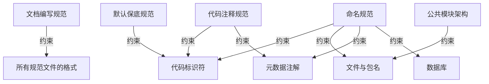

# OWL 设计规范

| 属性     | 值         |
| -------- | ---------- |
| 状态     | 已批准     |
| 负责人   | 仓库 Owner |
| 创建时间 | 2026-08-27 |
| 更新时间 | 2026-08-27 |
| 适用版本 | 全部       |

## 概述

本目录存放 OWL 项目的全部设计规范，覆盖代码风格、命名约定、架构设计和文档编写。

每份规范各司其职，互不重复。新增规范前先确认是否可归入现有文件。

## 规范文件索引

### 命名规范（`naming/`）

命名是代码可读性的第一道关口。以下规范约束项目中所有命名行为：

| 文件                                                                                        | 范围       | 说明                                                        |
| ------------------------------------------------------------------------------------------- | ---------- | ----------------------------------------------------------- |
| [code-file-naming-convention.md](naming/code-file-naming-convention.md)                     | 文件与包名 | Java 文件名、包路径、目录结构、资源文件命名                 |
| [code-identifier-naming-convention.md](naming/code-identifier-naming-convention.md)         | 标识符     | 类、接口、枚举、方法、变量、常量命名                        |
| [metadata-annotation-naming-convention.md](naming/metadata-annotation-naming-convention.md) | 元数据注解 | `@Tag`、`@Operation`、`@Schema`、`@RequestMapping` 路径命名 |
| [database-naming-convention.md](naming/database-naming-convention.md)                       | 数据库     | 表名、字段名、索引名命名                                    |

### 代码规范

| 文件                                                         | 说明                                            |
| ------------------------------------------------------------ | ----------------------------------------------- |
| [code-comment-standard.md](code-comment-standard.md)         | 代码注释规范：Javadoc、行内注释、TODO、注解描述 |
| [default-fallback-standard.md](default-fallback-standard.md) | 默认值与保底逻辑规范                            |

### 架构规范

| 文件                                                           | 说明                                                                  |
| -------------------------------------------------------------- | --------------------------------------------------------------------- |
| [common-module-architecture.md](common-module-architecture.md) | 公共模块架构说明：`common`、`infra`、`log`、`api`、`start` 职责与依赖 |

### 文档规范

| 文件                                                   | 说明                                         |
| ------------------------------------------------------ | -------------------------------------------- |
| [documentation-standard.md](documentation-standard.md) | 文档编写规范：分类、结构、写作要求、评审流程 |

## 使用指南

### 按角色

| 角色     | 必读                       | 建议阅读               |
| -------- | -------------------------- | ---------------------- |
| 后端开发 | 全部命名规范、代码注释规范 | 架构规范、默认保底规范 |
| 前端开发 | 元数据注解命名规范         | 文档编写规范           |
| DBA      | 数据库命名规范             | —                      |
| 架构师   | 架构规范、全部命名规范     | 文档编写规范           |
| 技术写作 | 文档编写规范               | 代码注释规范           |

### 按场景

| 场景            | 查阅                                                        |
| --------------- | ----------------------------------------------------------- |
| 新建 Controller | 元数据注解命名规范 → `@Tag`、`@Operation`                   |
| 新建 DTO/VO     | 代码标识符命名规范 → DTO/VO；元数据注解命名规范 → `@Schema` |
| 新建 Entity     | 代码标识符命名规范 → DO；数据库命名规范 → 字段命名          |
| 新建数据库表    | 数据库命名规范 → 表命名 + 字段命名                          |
| 新建业务模块    | 代码文件与包名命名规范 → 目录结构                           |
| 写注释          | 代码注释规范                                                |
| 写文档          | 文档编写规范                                                |
| 新增公共能力    | 公共模块架构说明                                            |

## 规范之间的关系



## 规范生命周期

每份规范的状态流转：

```text
草稿 → 评审中 → 已批准 → 已废弃
```

- 所有规范默认为「已批准」状态，修改需要通过 PR。
- 规范变更必须同步更新元信息中的「更新时间」。
- 规范被替代时标记为「已废弃」并指明替代文档。

## 变更历史

- 2026-08-27：创建规范目录总索引，数据库命名规范移入 `naming/` 子目录。

## 相关文档

- [OWL 文档中心](../README.md)
