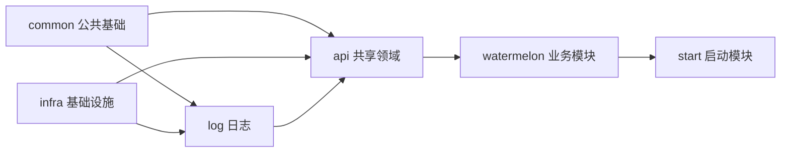
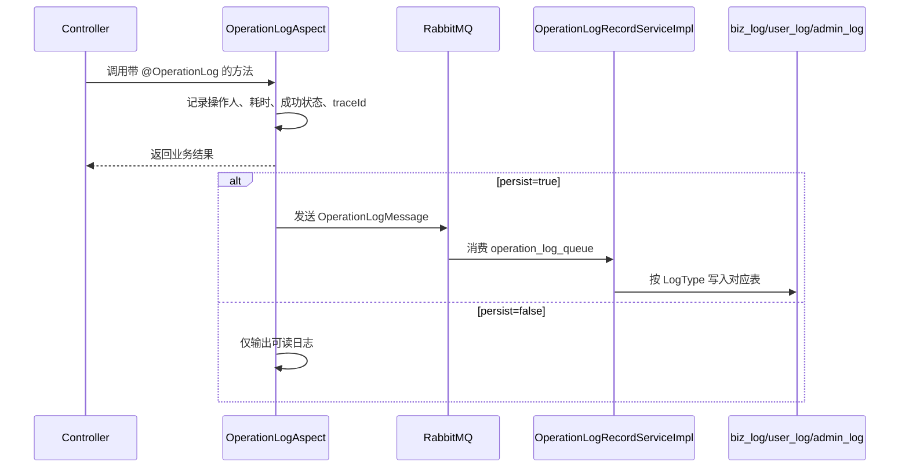

# OWL 公共模块架构说明

| 属性     | 值         |
| -------- | ---------- |
| 状态     | 已批准     |
| 负责人   | 仓库 Owner |
| 创建时间 | 2026-08-16 |
| 更新时间 | 2026-08-16 |
| 适用版本 | 0.0.1      |

## 背景与目标

OWL 是 Spring Boot 4.1 + Java 25 的多模块 Maven 项目。
业务模块位于 `watermelon/` 下，公共能力统一沉淀在 `common`、`infra`、`log`、`api` 四个模块中，由 `start` 模块负责组装启动。

本文只介绍公共模块，目标是回答以下问题：

- 每个公共模块承担什么职责。
- 模块之间如何依赖、如何协作。
- 新增业务模块时应该复用哪些公共能力。
- 新增公共能力时应该放在哪个模块。

## 模块总览

| 模块     | artifactId | 定位                                           | 核心依赖                                                    |
| -------- | ---------- | ---------------------------------------------- | ----------------------------------------------------------- |
| `common` | `common`   | 统一返回、异常、安全认证、邮件、公共配置、工具 | Spring Boot Web、Security、Mail、MyBatis-Plus、JWT、Knife4j |
| `infra`  | `infra`    | Redis、RabbitMQ、Nacos、MinIO、布隆过滤器      | Spring Data Redis、AMQP、Nacos、MinIO                       |
| `log`    | `log`      | 操作日志、traceId、日志异步落库                | `common`、`infra`                                           |
| `api`    | `api`      | 跨业务模块共享的领域模型与 Mapper              | `common`、`infra`、`log`、Web MVC、Validation               |
| `start`  | `start`    | 可运行入口，聚合全部业务模块                   | 各业务模块                                                  |

依赖方向如下：



说明：

- `common` 与 `infra` 是并列的底层能力模块，互不依赖。
- `log` 同时依赖 `common` 和 `infra`，既读取登录用户上下文，又通过 RabbitMQ 异步写日志。
- `api` 聚合 `common`、`infra`、`log`，业务模块只需依赖 `api` 即可获得完整基础能力。
- `start` 只负责启动和组装，不承载业务代码。

## 一、common 公共基础模块

### 1. 模块定位

`common` 是 OWL 最底层的公共基础模块，提供所有业务模块通用的基础设施：
统一响应、统一异常、认证授权、JWT、邮件、Knife4j、MyBatis-Plus、CORS 和基础校验工具。

依赖说明：

- 引入 Spring AI Starter，供 `crow` AI 对话模块使用。
- 引入 MyBatis-Plus Generator 与 Velocity，供开发期代码生成使用，不影响运行期。

### 2. 能力清单

| 包 / 类                                        | 作用                                                                                     |
| ---------------------------------------------- | ---------------------------------------------------------------------------------------- |
| `common.result.Result<T>`                      | 统一响应包装：`code`、`message`、`data`，提供 `success`、`fail`、`create` 等静态工厂方法 |
| `common.result.ResultPage<T>`                  | 分页响应包装：页码、每页条数、总数、总页数、记录列表                                     |
| `common.result.ResultStatus`                   | 统一状态码枚举：HTTP 状态、9xxx 业务状态、401xxx Token 状态                              |
| `common.exception.BizException`                | 携带业务状态码的运行时业务异常                                                           |
| `common.exception.GlobalExceptionHandler`      | 全局异常处理：业务异常、参数校验、权限、唯一键冲突、404、405、上传超限、兜底异常         |
| `common.exception.RestErrorController`         | 接管 `/error`，未知路径和静态资源始终返回 JSON，不暴露 Whitelabel 页面                   |
| `common.security.JwtTokenProvider`             | 生成和解析 JWT，包含 `jti`、`tokenVersion`、用户信息等 Claims                            |
| `common.security.JwtAuthenticationFilter`      | 解析 `Authorization: Bearer <token>`，校验 token 版本与撤销状态，写入 SecurityContext    |
| `common.security.SecurityConfig`               | Spring Security 配置：无状态、CORS、白名单、角色鉴权、方法级安全                         |
| `common.security.CurrentUserContext`           | 基于 ThreadLocal 的当前登录用户上下文，业务代码获取 `userId`、`userCode`、`roleName`     |
| `common.security.LoginUser`                    | 登录用户模型：用户 ID、用户编码、邮箱、角色名                                            |
| `common.security.TokenRevocationService`       | Token 撤销与版本控制接口，由业务模块提供 Redis 等实现                                    |
| `common.security.RestAuthenticationEntryPoint` | 未认证或 Token 无效时返回 JSON 401                                                       |
| `common.security.RestAccessDeniedHandler`      | 已认证但无权限时返回 JSON 403                                                            |
| `common.mail.MailService` / `MailMessage`      | 通用邮件接口与消息模型，支持发件人名称、回复地址、HTML、抄送、密送                       |
| `common.mail.impl.MailServiceImpl`             | 基于 Spring `JavaMailSender` 的邮件实现                                                  |
| `common.config.JacksonConfig`                  | 补充 Jackson 2 `ObjectMapper` Bean，兼容 Boot 4 默认 Jackson 3                           |
| `common.config.MybatisPlusConfig`              | MyBatis-Plus 分页插件与乐观锁插件                                                        |
| `common.config.SpringdocConfig`                | OpenAPI 全局信息、JWT 安全方案、按业务模块分组                                           |
| `common.config.WebMvcConfig`                   | 全局 CORS 配置                                                                           |
| `common.domain.dto.PageDTO`                    | 通用分页入参，默认页码 1、每页 10 条                                                     |
| `common.utils.regex.RegexUtil`                 | 手机号、邮箱、密码、验证码正则校验                                                       |

### 3. 统一返回与状态码

所有 Controller 方法统一返回 `Result<T>`，前端只解析一个响应模型。

状态码分四段：

- `2xx`：成功类状态。
- `4xx` / `5xx`：HTTP 语义状态。
- `9xxx`：业务自定义状态，例如验证码错误、库存不足、角色被占用。
- `401xxx`：Token 细分状态，例如过期、无效、账号禁用。

分页接口使用 `ResultPage<T>`，由 MyBatis-Plus `IPage<T>` 直接转换，避免每个业务模块重复包装。

### 4. 安全认证流程

`SecurityConfig` 默认是无状态 JWT 认证：

1. 请求进入 `JwtAuthenticationFilter`。
2. 过滤器从请求头读取 `Bearer <token>` 并解析 Claims。
3. 通过 `TokenRevocationService` 检查 `jti` 是否被撤销、`tokenVersion` 是否仍有效。
4. 校验通过后写入 `SecurityContext` 与 `CurrentUserContext`。
5. 业务代码通过 `CurrentUserContext` 获取当前用户，不再重复解析 token。

当前公开白名单包含：

- 验证码发送、邮箱登录、密码登录、密码重置。
- `/api/public/**`。
- Knife4j / Swagger 文档路径。
- 后台首页配置 `feature`、`spotlight` 等只读接口。

`/api/admin/**` 要求 `ROLE_ADMIN`，其余接口默认要求登录。

### 5. 邮件流程

`common` 只负责邮件发送能力，不处理验证码业务。
业务模块调用 `MailService.send(...)` 或 `MailService.send(MailMessage)` 即可发送邮件。

`MailMessage` 支持：

- 自定义发件人显示名称。
- HTML 正文。
- 回复地址。
- 抄送、密送。
- 纯文本与 HTML 切换。

默认发件人邮箱读取 `spring.mail.username`，默认显示名称读取 `spring.mail.sender-name`。

### 6. 公共配置说明

- `MybatisPlusConfig`：统一启用 MySQL 分页和乐观锁，业务模块不需要重复配置。
- `SpringdocConfig`：统一生成 OpenAPI 文档，并按用户、电商、后台、价格、AI 等模块分组。
- `WebMvcConfig`：允许所有来源跨域，生产环境应按域名收紧。
- `JacksonConfig`：解决 Boot 4 Jackson 3 与存量 Jackson 2 代码的兼容问题。

## 二、infra 基础设施模块

### 1. 模块定位

`infra` 负责所有外部中间件和基础设施能力，与业务规则解耦。
当前覆盖 Redis、RabbitMQ、Nacos、MinIO 和布隆过滤器。

### 2. 能力清单

| 包 / 类                                                | 作用                                                               |
| ------------------------------------------------------ | ------------------------------------------------------------------ |
| `infra.redis.config.RedisConfig`                       | RedisTemplate、StringRedisTemplate、Spring Cache、Redis 缓存序列化 |
| `infra.rabbitmq.config.OperationLogMqConfig`           | 操作日志队列、交换机、绑定关系、JSON 消息转换器                    |
| `infra.rabbitmq.constant.RabbitMQConstant`             | RabbitMQ 队列、交换机、路由键常量                                  |
| `infra.minio.config.MinioConfig`                       | 根据配置创建 `MinioClient`                                         |
| `infra.minio.properties.MinioProperties`               | `storage.minio` 配置绑定，支持多 Bucket                            |
| `infra.minio.constant.MinioConstant`                   | 头像、图片、视频、文档等 Bucket 常量                               |
| `infra.minio.service.FileStorageService`               | 文件上传、预签名 URL、删除的统一接口                               |
| `infra.minio.service.impl.MinioFileServiceImpl`        | MinIO 实现：启动自动建桶、日期目录 + UUID 存储、URL 有效期控制     |
| `infra.bloom.service.BloomFilterService`               | 布隆过滤器统一接口                                                 |
| `infra.bloom.service.Impl.GuavaBloomFilterServiceImpl` | 基于 Guava 的内存布隆过滤器，防缓存穿透                            |

### 3. Redis 能力

`RedisConfig` 提供：

- `RedisTemplate<String, Object>`：JSON 序列化并保留类型信息，支持直接存对象。
- `StringRedisTemplate`：验证码、Token 黑名单等字符串场景使用。
- `RedisCacheManager`：默认缓存 TTL 10 分钟，key 使用 String 序列化，value 使用 JSON。
- Lettuce 读写分离：优先从副本读取。

业务示例：

- `watermelon/user` 的 `RedisTokenRevocationServiceImpl` 使用 `StringRedisTemplate` 保存 JWT 黑名单和 token 版本。
- 验证码、短信、会话等业务也可直接使用 Redis。

### 4. RabbitMQ 能力

`infra` 当前固定声明操作日志链路：

- 队列：`operation_log_queue`，持久化。
- 交换机：`operation_log_exchange`。
- 路由键：`operation_log_routing_key`。
- 消息转换器：`JacksonJsonMessageConverter`。

其他业务若需要 MQ，可继续复用 `infra.rabbitmq` 包，或按业务模块新增独立声明。

### 5. Nacos 能力

`infra` POM 引入 Nacos Config 与 Discovery Starter。
实际配置在 `start` 的 `application.yaml` 中加载：

- `common.yaml`：公共配置。
- `database.yaml`：数据源配置。
- `cache.yaml`：Redis 配置。
- `message.yaml`：RabbitMQ 配置。
- `email.yaml`：邮件配置。
- `ai.yaml`：Spring AI 配置。
- `sensitive.yaml`：密码、密钥等敏感配置。

### 6. MinIO 能力

`MinioFileServiceImpl` 提供：

- 启动时自动检查并创建配置中的 Bucket。
- `upload(file, bucket)`：按 `yyyy/MM/dd/UUID.ext` 生成对象名。
- `getUrl(bucket, object)`：默认生成 1 小时预签名 URL。
- `getUrl(bucket, object, expiry)`：自定义有效期。
- `delete(bucket, object)`：删除对象。

默认 `upload(MultipartFile)` 使用 `temp` Bucket，兼容旧调用。

### 7. 布隆过滤器能力

`GuavaBloomFilterServiceImpl` 是进程内布隆过滤器：

- 预估容量 100 万条。
- 假阳性率 1%。
- 内存约 1.2 MB。
- 用于防缓存穿透：写入时 `add(key)`，查询前 `mightContain(key)`。

局限：

- 重启后数据重建。
- 多实例各自维护，不共享。
- 后续可替换为 Redis 版布隆过滤器，业务接口无需变化。

## 三、log 日志模块

### 1. 模块定位

`log` 提供统一操作日志能力：
通过注解 + AOP 采集操作日志，通过 traceId 串联单次请求，通过 RabbitMQ 解耦日志落库。

### 2. 能力清单

| 包 / 类                                          | 作用                                                          |
| ------------------------------------------------ | ------------------------------------------------------------- |
| `log.annotation.OperationLog`                    | 方法级操作日志注解，声明类型、模块、动作、是否落库            |
| `log.aspect.OperationLogAspect`                  | AOP 拦截 `@OperationLog`，记录成功状态、耗时、操作人、traceId |
| `log.filter.TraceIdFilter`                       | 每个请求生成或透传 traceId，写入 MDC 和响应头                 |
| `log.constant.LogType`                           | 日志类型：`BIZ`、`USER`、`ADMIN`                              |
| `log.domain.message.OperationLogMessage`         | 发送到 RabbitMQ 的日志消息                                    |
| `log.domain.entity.BizLogDO`                     | `biz_log` 业务日志实体                                        |
| `log.domain.entity.UserLogDO`                    | `user_log` 用户操作日志实体                                   |
| `log.domain.entity.AdminLogDO`                   | `admin_log` 管理员操作日志实体                                |
| `log.mapper.*`                                   | 三类日志表的 MyBatis-Plus Mapper                              |
| `log.service.OperationLogRecordService`          | 操作日志落库接口                                              |
| `log.service.impl.OperationLogRecordServiceImpl` | RabbitMQ 消费者，按日志类型写入对应表                         |
| `log.config.LogAutoConfiguration`                | 日志模块自动配置标记类                                        |

### 3. 工作流程



使用示例：

```java
@OperationLog(type = LogType.ADMIN, module = "角色管理", action = "新增角色", persist = true)
public void createRole(...) {
    // 业务逻辑
}
```

### 4. 与 common、infra 的协作

- 操作人来自 `common.security.CurrentUserContext`。
- MQ 队列与交换机来自 `infra.rabbitmq`。
- `persist=true` 时日志异步写入数据库，不影响主业务响应。
- `persist=false` 时只输出控制台或文件日志。

## 四、api 共享领域模块

### 1. 模块定位

`api` 是跨业务模块共享的领域层，避免 `user` 与 `administration` 之间产生循环依赖。
当前主要承载角色实体和 Mapper。

### 2. 能力清单

| 包 / 类                    | 作用                                                      |
| -------------------------- | --------------------------------------------------------- |
| `api.domain.entity.RoleDO` | `user_role` 表共享实体：角色名、描述、启用状态、创建与更新时间 |
| `api.mapper.RoleMapper`    | 角色表 MyBatis-Plus Mapper                                |

### 3. 为什么单独放 api

- 用户登录需要读取角色。
- 后台角色管理需要增删改查角色。
- 如果放在 `user` 或 `administration`，另一个模块就要反向依赖，容易形成循环依赖。

因此将角色模型提升到 `api`，两个模块共同依赖，既符合领域边界，也避免模块耦合。

### 4. 传递依赖

`api` POM 依赖 `common`、`infra`、`log`，同时引入 Web MVC 与 Validation。
业务模块只需声明 `api` 依赖，即可获得：

- 统一返回与异常处理。
- JWT 与 Security。
- Redis、RabbitMQ、MinIO。
- 操作日志能力。
- Controller、参数校验等 Web 能力。

## 五、start 启动模块

### 1. 模块定位

`start` 不是公共能力模块，而是最终可运行入口。
它依赖全部业务模块，并配置 Nacos 外部配置、日志级别和启动参数。

### 2. 能力清单

| 文件                    | 作用                                                                  |
| ----------------------- | --------------------------------------------------------------------- |
| `StartApplication.java` | `@SpringBootApplication` + `@EnableRabbit`，扫描根包 `xyz.nanian.owl` |
| `application.yaml`      | 应用名、默认 dev profile、Nacos 地址与配置导入                        |
| `application-dev.yml`   | 开发环境日志级别                                                      |
| `application-prod.yml`  | 生产环境环境变量模板                                                  |
| `bootstrap.yml`         | Nacos Config / Discovery 模板，当前已注释                             |
| `logback-spring.xml.1`  | Logback 配置模板，启用后输出 traceId                                  |

### 3. 启动注意

本地启动依赖：

- MySQL。
- Redis。
- RabbitMQ。
- Nacos。
- MinIO。

数据源、Redis、MQ、邮件、AI 等配置由 Nacos 下发，`start` 只负责加载与启动。

## 六、公共模块协作示例

### 1. 验证码登录

1. `user` Controller 接收邮箱。
2. 使用 `common.utils.regex.RegexUtil` 校验邮箱格式。
3. 使用 `common.mail.MailService` 发送验证码邮件。
4. 验证码存入 Redis，Redis 能力来自 `infra`。
5. 登录成功后使用 `common.security.JwtTokenProvider` 签发 JWT。
6. 后续请求由 `JwtAuthenticationFilter` 自动认证。

### 2. 后台角色管理

1. `administration` 使用 `api.mapper.RoleMapper` 操作 `user_role` 表。
2. 用户登录时也使用同一 `RoleDO`，保证角色名一致。
3. 写操作添加 `@OperationLog`，日志通过 RabbitMQ 异步落库。

### 3. 文件上传

1. Controller 接收 `MultipartFile`。
2. 调用 `infra.minio.service.FileStorageService.upload(...)`。
3. 返回 MinIO 对象名。
4. 查询时调用 `getUrl(...)` 生成预签名 URL。

## 七、新增公共能力时的放置建议

| 能力类型                               | 放置位置 |
| -------------------------------------- | -------- |
| 统一返回、异常、认证、邮件、通用配置   | `common` |
| Redis、MQ、Nacos、对象存储、缓存穿透   | `infra`  |
| 操作日志、traceId、日志落库            | `log`    |
| 多个业务模块共享的实体 / Mapper / 服务 | `api`    |
| 运行入口、环境配置、Nacos 导入         | `start`  |

新增模块时优先复用现有公共能力，不要在每个业务模块里重复实现。

## 变更历史

- 2026-08-16：创建公共模块架构说明。

## 相关文档

- [OWL 文档中心](../README.md)
- [OWL 文档编写规范](documentation-standard.md)
- [新模块添加指南](新模块开发指南.md)
